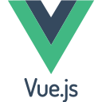
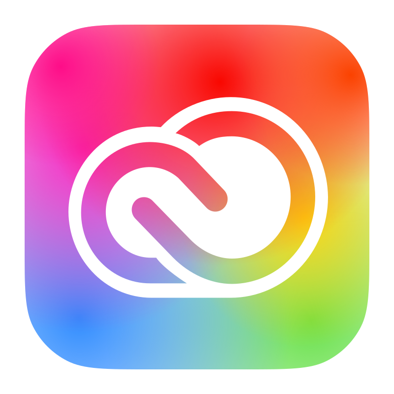

## Hi there, it's J.P. 👋
- 🔭 I’m currently sitting on a rock speeding 67,000 mph around the sun.
- 📫 How to reach me: ...
  - [LinkedIn](https://www.linkedin.com/in/jpnpgenx/)
  - [My site](https://www.npgenx.com)
<!--
**npgenx/npgenx** is a ✨ _special_ ✨ repository because its `README.md` (this file) appears on your GitHub profile.

Here are some ideas to get you started:

- 🔭 I’m currently working on ...
- 🌱 I’m currently learning ...
- 👯 I’m looking to collaborate on ...
- 🤔 I’m looking for help with ...
- 💬 Ask me about ...
- 📫 How to reach me: ...
- 😄 Pronouns: ...
- ⚡ Fun fact: ...
-->

## My Skills Set
### Languages

  
&nbsp;  
&nbsp;  
&nbsp; 
&nbsp;   
&nbsp; 

 

### Frontend / Design 

  
&nbsp;   
&nbsp; 
&nbsp;    
&nbsp; 
&nbsp;  
&nbsp; 
&nbsp;   
&nbsp; 
&nbsp; <a href="https://ui.shadcn.com/" target="_blank"><picture height="28" >
<source media="(prefers-color-scheme: dark)" height="28"  srcset="./assets/shadcnui-dark.svg">
<source media="(prefers-color-scheme: light)" height="28"  srcset="./assets/shadcnui.svg">
</picture></a>    
&nbsp;     
&nbsp; 
&nbsp; 
&nbsp; 
<!-- &nbsp;   -->
&nbsp;   
&nbsp; 
&nbsp;   

 

### Backend / Databases

  
&nbsp; <a href="https://nodejs.org/" target="_blank"><picture height="28" >
<source media="(prefers-color-scheme: dark)" height="28"  srcset="./assets/nodejs-dark.svg">
<source media="(prefers-color-scheme: light)" height="28"  srcset="./assets/nodejs.svg">
</picture></a> 
&nbsp; <a href="https://expressjs.com/" target="_blank"><picture height="28" >
<source media="(prefers-color-scheme: dark)" height="28"  srcset="./assets/express-original-wordmark-dark.svg">
<source media="(prefers-color-scheme: light)" height="28"  srcset="./assets/express-original-wordmark.svg">
</picture></a>
&nbsp; 
&nbsp; 
&nbsp; 
&nbsp; 
&nbsp;  
&nbsp;   
&nbsp;  

 

### DevOps / Tools

  
&nbsp; 
&nbsp;   
&nbsp; <a href="https://aws.amazon.com/" target="_blank"><picture height="28" >
<source media="(prefers-color-scheme: dark)" height="28"  srcset="./assets/amazonwebservices-dark.svg">
<source media="(prefers-color-scheme: light)" height="28"  srcset="./assets/amazonwebservices-original-wordmark.svg">
</picture></a>  
&nbsp; 
&nbsp;   
&nbsp;   
&nbsp; 
&nbsp; 
&nbsp; <a href="https://docs.github.com/en/actions" target="_blank"><picture height="28" >
<source media="(prefers-color-scheme: dark)" height="28" margin="30px" padding="30px" srcset="./assets/github-mark-white.svg">
<source media="(prefers-color-scheme: light)" height="28" margin="30px" padding="30px" srcset="./assets/github-mark.svg">

</picture></a>
&nbsp; 
&nbsp;     
&nbsp;   
&nbsp; 
&nbsp;   

